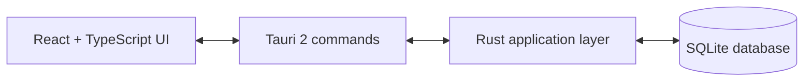

# Bundle Valley Co

Bundle Valley Co is a desktop companion for tracking progress toward completing the Community Center in Stardew Valley. It keeps bundle requirements and item status in one local application, so you can see what is missing, what has been collected, and what has already been delivered without keeping a separate checklist.

This is a fan-made, unofficial application. It is not affiliated with or endorsed by ConcernedApe or the official Stardew Valley game.

## Features

- Track the Community Center's 30 bundles across six rooms.
- Record each item's status as missing, collected, or delivered.
- Filter the bundle list by room.
- View overall item and bundle completion statistics.
- See progress bars for overall completion and individual bundles.
- Persist progress locally in an SQLite database.
- Use a Stardew Valley-inspired desktop interface.

## Technology

- React 19 and TypeScript for the user interface.
- Vite for frontend development and production builds.
- Tailwind CSS for styling.
- Tauri 2 for the desktop shell and frontend/backend integration.
- Rust for application commands and data access.
- `rusqlite` with bundled SQLite for local persistence.
- `serde` and Tauri commands for serializing data across the frontend/backend boundary.

## Architecture

The React and TypeScript frontend loads bundles and progress statistics through Tauri commands. When an item status changes, it updates the interface immediately and sends the new status to the Rust backend. Rust owns the SQLite connection, validates status values, and exposes the data operations used by the frontend.



The database is created under Tauri's application data directory as `bundle-valley.db`. On first startup, the application creates the `bundles` and `items` tables and seeds the Community Center data.

## Project Structure

```text
BundleValleyCo/
├── src/                         # React and TypeScript frontend
│   ├── App.tsx                  # Main UI and user interactions
│   ├── App.css                  # Application styling
│   └── main.tsx                 # Frontend entry point
├── src-tauri/                   # Rust and Tauri application layer
│   ├── src/
│   │   ├── main.rs              # Tauri setup and application state
│   │   ├── commands.rs          # Frontend-facing Tauri commands
│   │   ├── database.rs          # SQLite schema and queries
│   │   ├── models.rs            # Serialized data models
│   │   └── seed_data.rs         # Initial bundle and item data
│   ├── Cargo.toml               # Rust package and dependencies
│   └── tauri.conf.json          # Tauri build and window configuration
├── package.json                 # Frontend scripts and dependencies
└── bun.lock                     # Locked JavaScript dependencies
```

## Installation

### Windows prerequisites

To run or build the application from source on Windows, install:

- [Bun](https://bun.sh/) for JavaScript dependencies and project scripts.
- [Rust](https://rustup.rs/) with the stable MSVC toolchain.
- [Microsoft C++ Build Tools](https://visualstudio.microsoft.com/visual-cpp-build-tools/) with the Desktop development with C++ workload.
- [Microsoft Edge WebView2](https://developer.microsoft.com/microsoft-edge/webview2/) Runtime.

The published installer includes the application bundle and does not require the source-build toolchain.

### Install the published application

The latest published release currently provides a Windows x64 MSI installer:

1. Open the [v1 release](https://github.com/p-v-dev/BundleValleyCo/releases/tag/v1).
2. Download `Bundle.Valley.Co_0.1.0_x64_en-US.msi`.
3. Run the installer and launch **Bundle Valley Co**.

### Run from source

From a clone of the repository:

```powershell
git clone https://github.com/p-v-dev/BundleValleyCo.git
cd BundleValleyCo
bun install
bun run tauri dev
```

The `tauri dev` command starts the Vite development server through the command configured in `src-tauri/tauri.conf.json`.

### Build from source

To create a production frontend build:

```powershell
bun run build
```

To build the desktop application and its installer artifacts:

```powershell
bun run tauri build
```

Tauri writes the generated application artifacts under `src-tauri/target/release/bundle/`.

## Usage

1. Open a room or select **All Rooms**.
2. Change an item's status to **Collected** or **Delivered** as your progress changes.
3. Use the overall statistics and progress bars to review completion.
4. Return to the application later; progress is loaded from the local SQLite database.

## Development Checks

The repository does not currently define an automated test script or a test suite. The available frontend verification command is:

```powershell
bun run build
```

The source-build commands above are the supported development and packaging entry points. Performance, memory usage, installed size, and startup-time metrics are not specified here because this repository does not provide measured values for them.

## Contributing

Contributions are welcome:

1. Fork the repository.
2. Create a feature branch.
3. Make and verify your changes.
4. Open a pull request with a clear description.

## Credits

- [Stardew Valley](https://www.stardewvalley.net/) by ConcernedApe.
- [Stardew Valley Wiki](https://stardewvalleywiki.com/) for Community Center bundle information.
- [Pedro Vítor](https://github.com/p-v-dev), project author.

Project repository: [github.com/p-v-dev/BundleValleyCo](https://github.com/p-v-dev/BundleValleyCo)
